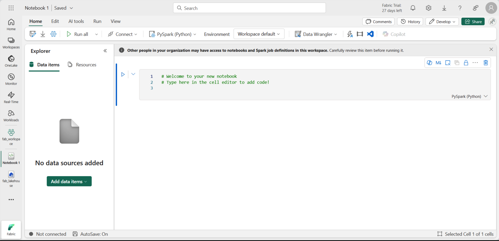
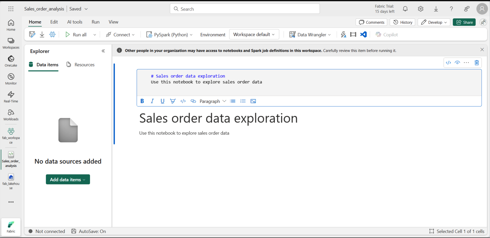
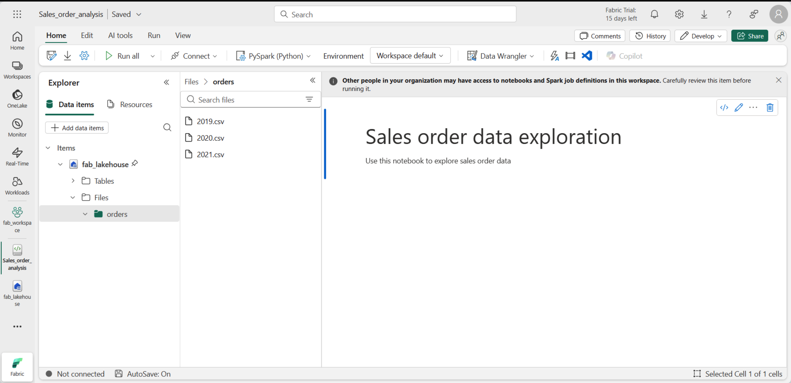
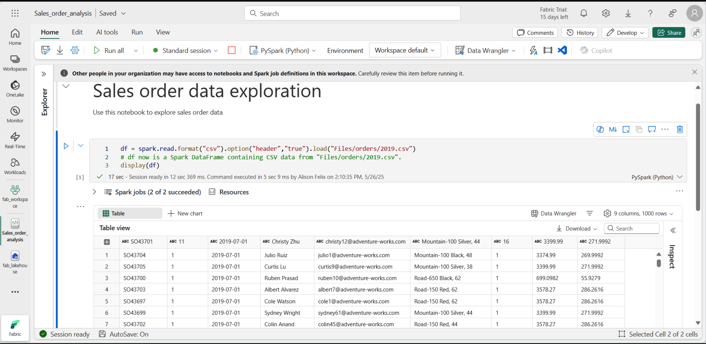
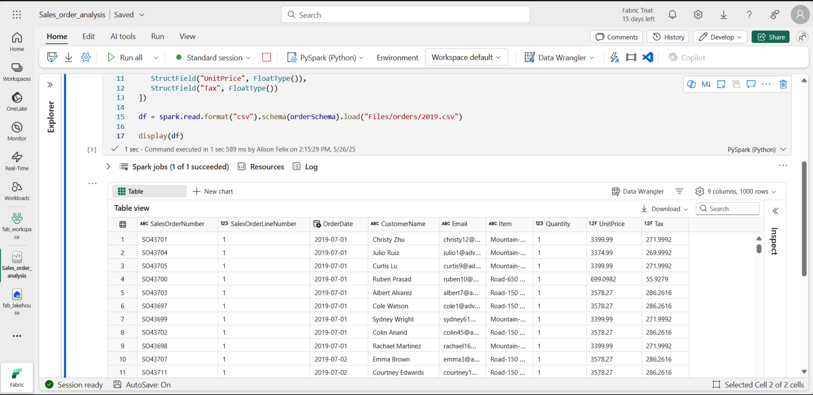
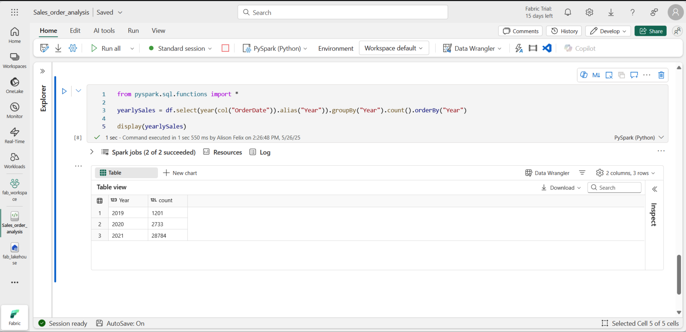
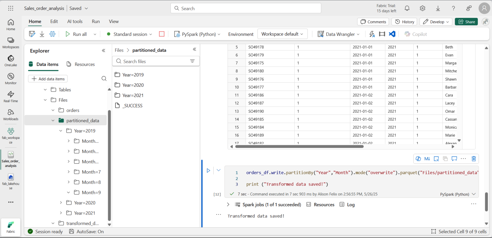
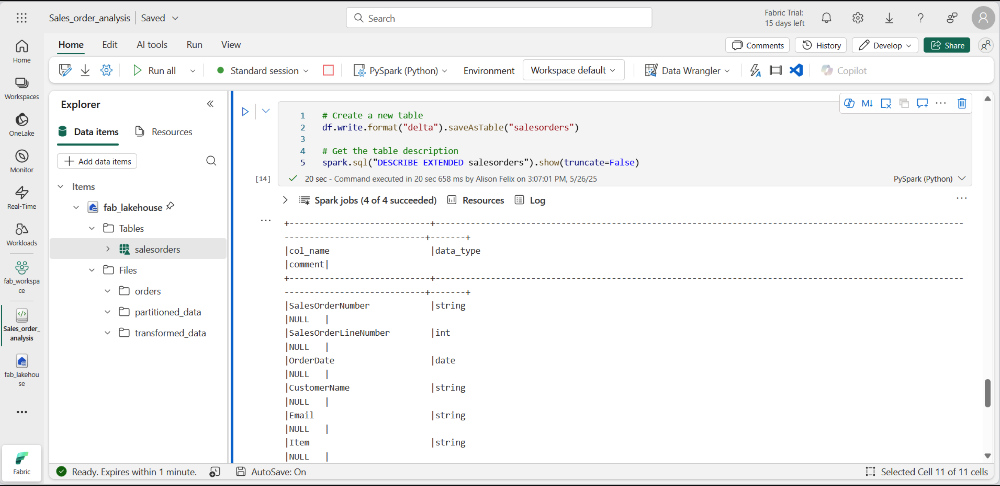
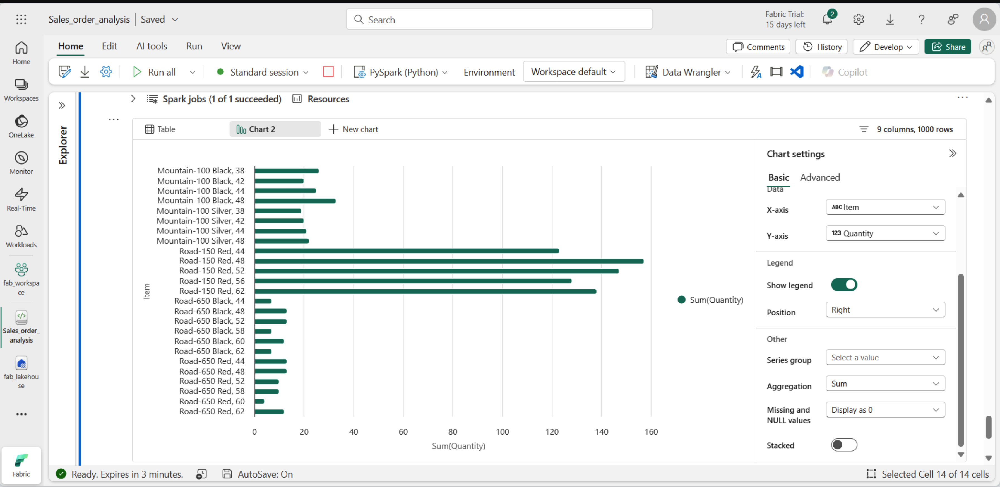

# 📘 Analyser les données avec Apache Spark dans Fabric

Dans ce laboratoire, vous ingérerez des données dans le lac **Microsoft Fabric** et utiliserez **PySpark** pour lire et analyser les données.  

⏱️ Ce laboratoire prendra environ **45 minutes** à compléter.  

> [!REMARQUE]  
> Vous devez avoir accès à un **locataire Microsoft Fabric** pour effectuer cet exercice.

---

## 🧱 Créer un espace de travail

Avant de travailler avec des données dans Fabric, créez un espace de travail dans un locataire avec la capacité Fabric activée.

1. Accédez à la page d’accueil de Microsoft Fabric :  
   👉 [https://app.fabric.microsoft.com/home?experience=fabric-developer](https://app.fabric.microsoft.com/home?experience=fabric-developer)
2. Connectez-vous avec vos informations d’identification Fabric.  
3. Dans la barre de menu à gauche, sélectionnez **Espaces de travail** (icône 🗇).  
4. Créez un nouvel espace de travail avec un **mode de licence Fabric** (Essai, Premium ou Fabric).  
5. Lorsque votre nouvel espace s’ouvre, il doit être **vide**.

📸 Capture d’écran :  


---

## 🌊 Créer un Lakehouse et téléverser des fichiers

Maintenant que vous disposez d’un espace de travail, créons un **Lakehouse** pour stocker vos données.

1. Dans la barre de menu de gauche, sélectionnez **Créer**.  
2. Sous **Ingénierie des données**, choisissez **Lakehouse** et donnez-lui un nom unique.  
   > Si l’option *Créer* n’est pas visible, cliquez sur les **…** pour la révéler.
3. Après environ une minute, votre Lakehouse est créé.

📸 Capture d’écran :  


4. Le volet d’exploration à gauche vous permet de naviguer dans les **fichiers et tables** du Lakehouse.  

5. Téléchargez les données depuis :  
   👉 [https://github.com/MicrosoftLearning/dp-data/raw/main/orders.zip](https://github.com/MicrosoftLearning/dp-data/raw/main/orders.zip)  
   Extrayez le fichier ZIP pour obtenir :  

2019.csv
2020.csv
2021.csv


6. Dans le **Lakehouse**, ouvrez le menu **… > Télécharger > Télécharger le dossier**, puis importez le dossier `orders`.

📸 Capture d’écran :  


---

## 📓 Créer un carnet

1. Vous pouvez désormais créer un notebook Fabric pour exploiter vos données. Les notebooks offrent un environnement interactif où vous pouvez écrire et exécuter du code.

Dans la barre de menu de gauche, sélectionnez « Créer » . Dans la page « Nouveau » , sous la section « Ingénierie des données » , sélectionnez « Notebook » .

📸 Capture d’écran :  


2. Fabric attribue un nom à chaque bloc-notes que vous créez, tel que Bloc-notes 1, Bloc-notes 2, etc. Cliquez sur le panneau de nom au-dessus de l' onglet Accueil dans le menu pour modifier le nom en quelque chose de plus descriptif.

3. Sélectionnez la première cellule (actuellement une cellule de code), puis, dans la barre d'outils en haut à droite, utilisez le bouton M↓ pour la convertir en cellule Markdown. Le texte contenu dans la cellule s'affichera alors sous forme de texte formaté.

4. Utilisez le bouton 🖉 (Modifier) ​​pour passer la cellule en mode édition, puis modifiez le markdown comme indiqué ci-dessous.

📸 Capture d’écran :  

Lorsque vous avez terminé, cliquez n’importe où dans le bloc-notes en dehors de la cellule pour arrêter la modification.

## Créer un DataFrame


Maintenant que vous avez créé un espace de travail, un lakehouse et un notebook, vous êtes prêt à exploiter vos données. Vous utiliserez PySpark, le langage par défaut des notebooks Fabric, et la version de Python optimisée pour Spark.

1. Sélectionnez votre nouvel espace de travail dans la barre de gauche. Vous verrez la liste des éléments qu'il contient, y compris votre Lakehouse et votre carnet.

2. Sélectionnez le Lakehouse pour afficher le volet Explorateur, y compris le dossier des commandes .

3. Dans le menu supérieur, sélectionnez « Ouvrir un carnet » , « Carnet existant » , puis ouvrez le carnet créé précédemment. Il devrait maintenant être ouvert à côté du volet Explorateur. Développez « Lakehouses », puis la liste des fichiers, et sélectionnez le dossier « Commandes ». Les fichiers CSV que vous avez importés sont listés à côté de l'éditeur de carnets, comme ceci :

📸 Capture d’écran :  


4. Dans le menu… du fichier 2019.csv, sélectionnez Charger les données > Spark . Le code suivant est automatiquement généré dans une nouvelle cellule :

```python
Le code suivant est généré :
df = spark.read.format("csv").option("header","true").load("Files/orders/2019.csv")
# df now is a Spark DataFrame containing CSV data from "Files/orders/2019.csv".
display(df)
```

1. Sélectionnez ▷ Exécuter la cellule à gauche de la cellule pour exécuter le code.
2.Une fois le code de la cellule terminé, examinez la sortie sous la cellule, qui devrait ressembler à ceci :


📸 Capture d’écran :  


2. Le résultat affiche les données du fichier 2019.csv, affichées en colonnes et en lignes. Notez que les en-têtes de colonnes contiennent la première ligne de données. Pour corriger ce problème, modifiez la première ligne du code comme suit :
```python
df = spark.read.format("csv").option("header","false").load("Files/orders/2019.csv")
```

3. Exécutez à nouveau le code afin que le DataFrame identifie correctement la première ligne comme donnée. Notez que les noms des colonnes sont désormais _c0, _c1, etc.

4. Des noms de colonnes descriptifs vous aident à donner du sens aux données. Pour créer des noms de colonnes pertinents, vous devez définir le schéma et les types de données. Vous devez également importer un ensemble standard de types Spark SQL pour définir les types de données. Remplacez le code existant par le code suivant :
```python
from pyspark.sql.types import *

orderSchema = StructType([
    StructField("SalesOrderNumber", StringType()),
    StructField("SalesOrderLineNumber", IntegerType()),
    StructField("OrderDate", DateType()),
    StructField("CustomerName", StringType()),
    StructField("Email", StringType()),
    StructField("Item", StringType()),
    StructField("Quantity", IntegerType()),
    StructField("UnitPrice", FloatType()),
    StructField("Tax", FloatType())
])

df = spark.read.format("csv").schema(orderSchema).load("Files/orders/2019.csv")

display(df)
```

5. Exécutez la cellule et examinez le résultat :

📸 Capture d’écran :  


6. Ce DataFrame inclut uniquement les données du fichier 2019.csv. Modifiez le code afin que le chemin d'accès au fichier utilise le caractère générique * pour lire tous les fichiers du dossier des commandes :
```python
from pyspark.sql.types import *

orderSchema = StructType([
    StructField("SalesOrderNumber", StringType()),
    StructField("SalesOrderLineNumber", IntegerType()),
    StructField("OrderDate", DateType()),
    StructField("CustomerName", StringType()),
    StructField("Email", StringType()),
    StructField("Item", StringType()),
    StructField("Quantity", IntegerType()),
    StructField("UnitPrice", FloatType()),
    StructField("Tax", FloatType())
])

df = spark.read.format("csv").schema(orderSchema).load("Files/orders/*.csv")

display(df)
```

7. Lorsque vous exécutez le code modifié, vous devriez voir les ventes pour 2019, 2020 et 2021. Seul un sous-ensemble des lignes est affiché, vous ne verrez donc peut-être pas de lignes pour chaque année.

## Explorer les données dans un DataFrame
L'objet DataFrame fournit des fonctionnalités supplémentaires telles que la possibilité de filtrer, de regrouper et de manipuler des données.

### Filtrer un DataFrame

1. Ajoutez une cellule de code en sélectionnant « + Code » qui apparaît lorsque vous passez la souris au-dessus ou en dessous de la cellule active ou de son résultat. Vous pouvez également sélectionner « Modifier » dans le menu du ruban, puis « + Ajouter une cellule de code ci-dessous .

2. Le code suivant filtre les données afin de ne renvoyer que deux colonnes. Il utilise également count et distinct pour résumer le nombre d'enregistrements :
```python

customers = df['CustomerName', 'Email']

print(customers.count())
print(customers.distinct().count())

display(customers.distinct())
```

3. Exécutez le code et examinez le résultat :

Le code crée un nouveau DataFrame appelé « clients » , contenant un sous-ensemble de colonnes du DataFrame df d'origine . Lors d'une transformation de DataFrame, le DataFrame d'origine n'est pas modifié, mais un nouveau DataFrame est renvoyé.
Une autre façon d’obtenir le même résultat est d’utiliser la méthode select :

```python
customers = df.select("CustomerName", "Email")

```

Les fonctions DataFrame count et distinct sont utilisées pour fournir des totaux pour le nombre de clients et de clients uniques.

4. Modifiez la première ligne du code en utilisant select avec une fonction where comme suit :

```python
customers = df.select("CustomerName", "Email").where(df['Item']=='Road-250 Red, 52')
print(customers.count())
print(customers.distinct().count())

display(customers.distinct())
```

5. Exécutez le code modifié pour sélectionner uniquement les clients ayant acheté le produit Road-250 Red, 52. Notez que vous pouvez « chaîner » plusieurs fonctions afin que la sortie d'une fonction devienne l'entrée de la suivante. Dans ce cas, le DataFrame créé par la méthode select est le DataFrame source de la méthode where utilisée pour appliquer les critères de filtrage.

## Agréger et regrouper des données dans un DataFrame

1. Ajoutez une cellule de code et entrez le code suivant 

```python
productSales = df.select("Item", "Quantity").groupBy("Item").sum()

display(productSales)
```

2. Exécutez le code. Vous pouvez constater que les résultats affichent la somme des quantités commandées, regroupées par produit. La méthode groupBy regroupe les lignes par article, et la fonction d'agrégation sum qui suit est appliquée aux colonnes numériques restantes (dans ce cas, Quantity ).

3. Ajoutez une autre cellule de code au bloc-notes et entrez le code suivant :

```python
from pyspark.sql.functions import *

yearlySales = df.select(year(col("OrderDate")).alias("Year")).groupBy("Year").count().orderBy("Year")

display(yearlySales)
```

4. Exécutez la cellule. Examinez le résultat. Les résultats indiquent maintenant le nombre de commandes par an :

L' instruction d'importation vous permet d'utiliser la bibliothèque Spark SQL.
La méthode select est utilisée avec une fonction année SQL pour extraire le composant année du champ OrderDate .
La méthode alias est utilisée pour attribuer un nom de colonne à la valeur de l'année extraite.
La méthode groupBy regroupe les données par colonne Année dérivée.
Le nombre de lignes dans chaque groupe est calculé avant que la méthode orderBy ne soit utilisée pour trier le DataFrame résultant.


📸 Capture d’écran :  



## Utilisez Spark pour transformer des fichiers de données

1. Ajoutez une cellule de code au bloc-notes et saisissez ce qui suit :

```python
from pyspark.sql.functions import *

# Create Year and Month columns
transformed_df = df.withColumn("Year", year(col("OrderDate"))).withColumn("Month", month(col("OrderDate")))

# Create the new FirstName and LastName fields
transformed_df = transformed_df.withColumn("FirstName", split(col("CustomerName"), " ").getItem(0)).withColumn("LastName", split(col("CustomerName"), " ").getItem(1))

# Filter and reorder columns
transformed_df = transformed_df["SalesOrderNumber", "SalesOrderLineNumber", "OrderDate", "Year", "Month", "FirstName", "LastName", "Email", "Item", "Quantity", "UnitPrice", "Tax"]

# Display the first five orders
display(transformed_df.limit(5))
```


2. Exécutez la cellule. Un nouveau DataFrame est créé à partir des données de la commande d'origine, avec les transformations suivantes :

Colonnes Année et Mois ajoutées, basées sur la colonne OrderDate.
Colonnes FirstName et LastName ajoutées, basées sur la colonne CustomerName.
Les colonnes sont filtrées et réorganisées, et la colonne CustomerName est supprimée.``

3. Examinez la sortie et vérifiez que les transformations ont été apportées aux données.

Vous pouvez utiliser la bibliothèque Spark SQL pour transformer les données en filtrant les lignes, en dérivant, en supprimant, en renommant les colonnes et en appliquant d'autres modifications de données.


### Sauvegarder les données transformées
À ce stade, vous souhaiterez peut-être enregistrer les données transformées afin qu’elles puissent être utilisées pour une analyse plus approfondie.

Parquet est un format de stockage de données populaire car il stocke efficacement les données et est pris en charge par la plupart des systèmes d'analyse de données à grande échelle. En effet, la transformation des données nécessite parfois de les convertir d'un format, comme CSV, vers Parquet.

1. Pour enregistrer le DataFrame transformé au format Parquet, ajoutez une cellule de code et ajoutez le code suivant :

```python
transformed_df.write.mode("overwrite").parquet('Files/transformed_data/orders')

print ("Transformed data saved!")
```


2. Exécutez la cellule et attendez le message d'enregistrement des données. Ensuite, dans le volet Explorateur à gauche, dans le menu « … » du nœud « Fichiers », sélectionnez « Actualiser » . Sélectionnez le dossier « transformed_data » pour vérifier qu'il contient un nouveau dossier nommé « orders », qui contient lui-même un ou plusieurs fichiers Parquet.

3. Ajoutez une cellule avec le code suivant :

```python
orders_df = spark.read.format("parquet").load("Files/transformed_data/orders")
display(orders_df)
```

📸 Capture d’écran :  



4. Exécutez la cellule. Un nouveau DataFrame est créé à partir des fichiers Parquet du dossier transformed_data/orders . Vérifiez que les résultats affichent les données de commande chargées depuis les fichiers Parquet.


### Enregistrer les données dans des fichiers partitionnés

1. Ajoutez une cellule avec du code pour enregistrer le dataframe, en partitionnant les données par année et par mois :

```python
orders_df.write.partitionBy("Year","Month").mode("overwrite").parquet("Files/partitioned_data")

print ("Transformed data saved!")
```

2. Exécutez la cellule et attendez le message d'enregistrement des données. Ensuite, dans le volet Lakehouses à gauche, dans le menu « … » du nœud « Fichiers », sélectionnez « Actualiser » et développez le dossier partitioned_data pour vérifier qu'il contient une hiérarchie de dossiers nommés « Année=xxxx » , chacun contenant des dossiers nommés « Mois=xxxx » . Chaque dossier mensuel contient un fichier Parquet contenant les commandes du mois.

📸 Capture d’écran :  



3. Ajoutez une nouvelle cellule avec le code suivant pour charger un nouveau DataFrame à partir du fichier orders.parquet :

```python
orders_2021_df = spark.read.format("parquet").load("Files/partitioned_data/Year=2021/Month=*")

display(orders_2021_df)
```


4. Exécutez la cellule et vérifiez que les résultats affichent les données de commande pour les ventes en 2021. Notez que les colonnes de partitionnement spécifiées dans le chemin (Année et Mois) ne sont pas incluses dans le DataFrame.


## Travailler avec des tables et SQL

Vous avez maintenant vu comment les méthodes natives de l'objet DataFrame permettent d'interroger et d'analyser les données d'un fichier. Cependant, vous serez peut-être plus à l'aise avec les tables utilisant la syntaxe SQL. Spark fournit un métastore permettant de définir des tables relationnelles.

La bibliothèque Spark SQL prend en charge l'utilisation d'instructions SQL pour interroger les tables du métastore. Cela offre la flexibilité d'un lac de données avec le schéma de données structuré et les requêtes SQL d'un entrepôt de données relationnel – d'où le terme « data lakehouse ».

### Créer un tableau

Les tables d'un métastore Spark sont des abstractions relationnelles des fichiers du lac de données. Elles peuvent être gérées par le métastore ou en externe et gérées indépendamment de celui-ci.

1. Ajoutez une cellule de code au bloc-notes et entrez le code suivant, qui enregistre le DataFrame des données de commande client sous forme de table nommée salesorders :

```python
# Create a new table
df.write.format("delta").saveAsTable("salesorders")

# Get the table description
spark.sql("DESCRIBE EXTENDED salesorders").show(truncate=False)
```

1. Exécutez la cellule de code et examinez la sortie, qui décrit la définition de la nouvelle table.

2. Dans le volet Explorateur , dans le menu « … » du dossier « Tables », sélectionnez « Actualiser » . Développez ensuite le nœud « Tables » et vérifiez que la table « commandes » a bien été créée.

📸 Capture d’écran :  



Dans le menu … de la table des commandes, sélectionnez Charger les données > Spark . Une nouvelle cellule de code est ajoutée, contenant un code similaire à celui-ci :

```python
df = spark.sql("SELECT * FROM [your_lakehouse].salesorders LIMIT 1000")

display(df)
```

Exécutez le nouveau code, qui utilise la bibliothèque Spark SQL pour intégrer une requête SQL sur la table salesorder dans le code PySpark et chargez les résultats de la requête dans un DataFrame.

### Exécuter le code SQL dans une cellule
Bien qu'il soit utile de pouvoir intégrer des instructions SQL dans une cellule contenant du code PySpark, les analystes de données souhaitent souvent simplement travailler directement dans SQL.

1. Ajoutez une nouvelle cellule de code au bloc-notes et entrez le code suivant :

```sql
%%sql
SELECT YEAR(OrderDate) AS OrderYear,
       SUM((UnitPrice * Quantity) + Tax) AS GrossRevenue
FROM salesorders
GROUP BY YEAR(OrderDate)
ORDER BY OrderYear;
```

2. Exécutez la cellule et examinez les résultats. Observez :

La commande %%sql au début de la cellule (appelée magie) change le langage en Spark SQL au lieu de PySpark.
Le code SQL fait référence à la table des commandes clients que vous avez créée précédemment.
La sortie de la requête SQL s'affiche automatiquement comme résultat sous la cellule.


## Visualisez les données avec Spark
Les graphiques vous permettent d'identifier des schémas et des tendances plus rapidement qu'en analysant des milliers de lignes de données. Les notebooks Fabric intègrent une vue graphique, mais celle-ci n'est pas conçue pour les graphiques complexes. Pour mieux contrôler la création de graphiques à partir de données dans des DataFrames, utilisez des bibliothèques graphiques Python comme matplotlib ou seaborn .

### Afficher les résultats sous forme de graphique

1. Ajoutez une nouvelle cellule de code et entrez le code suivant :

```sql
%%sql
SELECT * FROM salesorders
```

2. Exécutez le code pour afficher les données de la vue des commandes client créée précédemment. Dans la section des résultats sous la cellule, sélectionnez « + Nouveau graphique » .

3. Utilisez le bouton Créer le mien en bas à droite de la section des résultats et définissez les paramètres du graphique :

Type de graphique : Graphique à barres
Axe des X : Article
Axe Y : Quantité
Groupe de séries : laisser vide
Agrégation : Somme
Valeurs manquantes et NULL : afficher comme 0
Empilé : non sélectionné

4. Votre graphique devrait ressembler à ceci :

📸 Capture d’écran :  



Démarrer avec matplotlib

1. Ajoutez une nouvelle cellule de code et entrez le code suivant :
```sql
sqlQuery = "SELECT CAST(YEAR(OrderDate) AS CHAR(4)) AS OrderYear, \
                SUM((UnitPrice * Quantity) + Tax) AS GrossRevenue, \
                COUNT(DISTINCT SalesOrderNumber) AS YearlyCounts \
            FROM salesorders \
            GROUP BY CAST(YEAR(OrderDate) AS CHAR(4)) \
            ORDER BY OrderYear"
df_spark = spark.sql(sqlQuery)
df_spark.show()
```
2. Exécutez le code. Il renvoie un DataFrame Spark contenant le chiffre d'affaires annuel et le nombre de commandes. Pour visualiser les données sous forme de graphique, nous utiliserons d'abord la bibliothèque Python matplotlib. Cette bibliothèque est la bibliothèque de traçage principale sur laquelle s'appuient de nombreuses autres et offre une grande flexibilité pour la création de graphiques.

3. Ajoutez une nouvelle cellule de code et ajoutez le code suivant :

```python
from matplotlib import pyplot as plt

# matplotlib requires a Pandas dataframe, not a Spark one
df_sales = df_spark.toPandas()

# Create a bar plot of revenue by year
plt.bar(x=df_sales['OrderYear'], height=df_sales['GrossRevenue'])

# Display the plot
plt.show()
```

4. Exécutez la cellule et examinez les résultats, qui se présentent sous forme d'un graphique à colonnes indiquant le chiffre d'affaires brut total pour chaque année. Examinez le code et remarquez les points suivants :

La bibliothèque matplotlib nécessite un Pandas DataFrame, vous devez donc convertir le Spark DataFrame renvoyé par la requête Spark SQL.
Au cœur de la bibliothèque matplotlib se trouve l' objet pyplot . Il constitue la base de la plupart des fonctionnalités de traçage.
Les paramètres par défaut génèrent un graphique utilisable, mais il existe une marge de manœuvre considérable pour le personnaliser.

5. Modifiez le code pour tracer le graphique comme suit :

```python
from matplotlib import pyplot as plt

# Clear the plot area
plt.clf()

# Create a bar plot of revenue by year
plt.bar(x=df_sales['OrderYear'], height=df_sales['GrossRevenue'], color='orange')

# Customize the chart
plt.title('Revenue by Year')
plt.xlabel('Year')
plt.ylabel('Revenue')
plt.grid(color='#95a5a6', linestyle='--', linewidth=2, axis='y', alpha=0.7)
plt.xticks(rotation=45)

# Show the figure
plt.show()
```

6. Exécutez à nouveau la cellule de code et visualisez les résultats. Le graphique est désormais plus compréhensible.

7. Un graphique est contenu dans une figure. Dans les exemples précédents, la figure a été créée implicitement, mais elle peut l'être explicitement. Modifiez le code pour tracer le graphique comme suit :
```python

from matplotlib import pyplot as plt

# Clear the plot area
plt.clf()

# Create a Figure
fig = plt.figure(figsize=(8,3))

# Create a bar plot of revenue by year
plt.bar(x=df_sales['OrderYear'], height=df_sales['GrossRevenue'], color='orange')

# Customize the chart
plt.title('Revenue by Year')
plt.xlabel('Year')
plt.ylabel('Revenue')
plt.grid(color='#95a5a6', linestyle='--', linewidth=2, axis='y', alpha=0.7)
plt.xticks(rotation=45)

# Show the figure
plt.show()
```

8. Exécutez à nouveau la cellule de code et visualisez les résultats. La figure détermine la forme et la taille du tracé.

9. Une figure peut contenir plusieurs sous-graphiques, chacun sur son propre axe. Modifiez le code pour tracer le graphique comme suit :

```python
from matplotlib import pyplot as plt

# Clear the plot area
plt.clf()

# Create a figure for 2 subplots (1 row, 2 columns)
fig, ax = plt.subplots(1, 2, figsize = (10,4))

# Create a bar plot of revenue by year on the first axis
ax[0].bar(x=df_sales['OrderYear'], height=df_sales['GrossRevenue'], color='orange')
ax[0].set_title('Revenue by Year')

# Create a pie chart of yearly order counts on the second axis
ax[1].pie(df_sales['YearlyCounts'])
ax[1].set_title('Orders per Year')
ax[1].legend(df_sales['OrderYear'])

# Add a title to the Figure
fig.suptitle('Sales Data')

# Show the figure
plt.show()
```

10. Réexécutez la cellule de code et affichez les résultats.


✅ Résumé
Dans ce laboratoire, vous avez appris à :
Créer un Lakehouse dans Microsoft Fabric
Ingest, transformer et stocker des données avec PySpark
Créer et interroger des Tables Delta
Générer des visualisations avec Matplotlib et Seaborn
