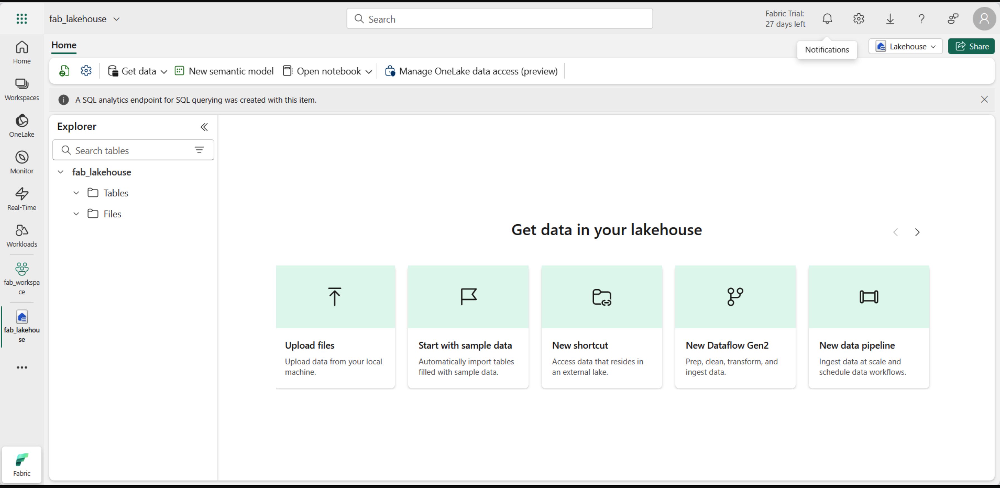

# 📘 Analyser les données avec Apache Spark dans Fabric

Dans ce laboratoire, vous ingérerez des données dans le lac **Microsoft Fabric** et utiliserez **PySpark** pour lire et analyser les données.  

⏱️ Ce laboratoire prendra environ **45 minutes** à compléter.  

> [!REMARQUE]  
> Vous devez avoir accès à un **locataire Microsoft Fabric** pour effectuer cet exercice.

---

## 🧱 Créer un espace de travail

Avant de travailler avec des données dans Fabric, créez un espace de travail dans un locataire avec la capacité Fabric activée.

1. Accédez à la page d’accueil de Microsoft Fabric :  
   👉 [https://app.fabric.microsoft.com/home?experience=fabric-developer](https://app.fabric.microsoft.com/home?experience=fabric-developer)
2. Connectez-vous avec vos informations d’identification Fabric.  
3. Dans la barre de menu à gauche, sélectionnez **Espaces de travail** (icône 🗇).  
4. Créez un nouvel espace de travail avec un **mode de licence Fabric** (Essai, Premium ou Fabric).  
5. Lorsque votre nouvel espace s’ouvre, il doit être **vide**.

📸 Capture d’écran :  


---

## 🌊 Créer un Lakehouse et téléverser des fichiers

Maintenant que vous disposez d’un espace de travail, créons un **Lakehouse** pour stocker vos données.

1. Dans la barre de menu de gauche, sélectionnez **Créer**.  
2. Sous **Ingénierie des données**, choisissez **Lakehouse** et donnez-lui un nom unique.  
   > Si l’option *Créer* n’est pas visible, cliquez sur les **…** pour la révéler.
3. Après environ une minute, votre Lakehouse est créé.

📸 Capture d’écran :  


4. Le volet d’exploration à gauche vous permet de naviguer dans les **fichiers et tables** du Lakehouse.  

5. Téléchargez les données depuis :  
   👉 [https://github.com/MicrosoftLearning/dp-data/raw/main/orders.zip](https://github.com/MicrosoftLearning/dp-data/raw/main/orders.zip)  
   Extrayez le fichier ZIP pour obtenir :  

2019.csv
2020.csv
2021.csv


6. Dans le **Lakehouse**, ouvrez le menu **… > Télécharger > Télécharger le dossier**, puis importez le dossier `orders`.

📸 Capture d’écran :  


---

## 📓 Créer un Notebook

Les notebooks Fabric permettent d’écrire et d’exécuter du code interactif.

1. Dans **Ingénierie des données**, cliquez sur **Créer > Notebook**.  
2. Un nouveau notebook (par ex. *Bloc-notes 1*) s’ouvre.  
3. Renommez-le (ex. : `Sales_Analysis`).  
4. Convertissez la première cellule en **Markdown** et insérez le texte suivant :

```markdown
# Sales order data exploration
Use this notebook to explore sales order data


## 🧮 Créer un DataFrame

Vous allez utiliser **PySpark** pour lire et afficher les données CSV.

1. Ouvrez votre **Lakehouse** dans le volet **Explorateur**.  
2. Dans le menu du fichier `2019.csv`, sélectionnez **Charger les données > Spark**.  

Le code suivant est généré :

```python
df = spark.read.format("csv").option("header","true").load("Files/orders/2019.csv")
display(df)
Exécutez la cellule pour afficher les données.
Si la première ligne est considérée comme donnée, corrigez le code :
df = spark.read.format("csv").option("header","false").load("Files/orders/2019.csv")
Définissez ensuite un schéma explicite pour les colonnes :
from pyspark.sql.types import *

orderSchema = StructType([
    StructField("SalesOrderNumber", StringType()),
    StructField("SalesOrderLineNumber", IntegerType()),
    StructField("OrderDate", DateType()),
    StructField("CustomerName", StringType()),
    StructField("Email", StringType()),
    StructField("Item", StringType()),
    StructField("Quantity", IntegerType()),
    StructField("UnitPrice", FloatType()),
    StructField("Tax", FloatType())
])

df = spark.read.format("csv").schema(orderSchema).load("Files/orders/*.csv")
display(df)
📸 Capture d’écran :
🔍 Explorer les données
Filtrer un DataFrame
customers = df.select("CustomerName", "Email").where(df['Item']=='Road-250 Red, 52')
print(customers.count())
print(customers.distinct().count())
display(customers.distinct())
Agréger et regrouper les données
from pyspark.sql.functions import *

productSales = df.select("Item", "Quantity").groupBy("Item").sum()
display(productSales)

yearlySales = df.select(year(col("OrderDate")).alias("Year")).groupBy("Year").count().orderBy("Year")
display(yearlySales)
📸 Capture d’écran :
🔄 Transformer les données
from pyspark.sql.functions import *

transformed_df = df.withColumn("Year", year(col("OrderDate"))) \
                   .withColumn("Month", month(col("OrderDate"))) \
                   .withColumn("FirstName", split(col("CustomerName"), " ").getItem(0)) \
                   .withColumn("LastName", split(col("CustomerName"), " ").getItem(1)) \
                   .select("SalesOrderNumber", "SalesOrderLineNumber", "OrderDate", "Year", "Month", 
                           "FirstName", "LastName", "Email", "Item", "Quantity", "UnitPrice", "Tax")

display(transformed_df.limit(5))
📸 Capture d’écran :
💾 Sauvegarder les données transformées
Enregistrer au format Parquet
transformed_df.write.mode("overwrite").parquet('Files/transformed_data/orders')
📸 Capture d’écran :
Partitionner les données
orders_df = spark.read.format("parquet").load("Files/transformed_data/orders")
orders_df.write.partitionBy("Year","Month").mode("overwrite").parquet("Files/partitioned_data")
📸 Capture d’écran :
🧩 Travailler avec des Tables et SQL
Créer une table Delta
df.write.format("delta").saveAsTable("salesorders")
spark.sql("DESCRIBE EXTENDED salesorders").show(truncate=False)
📸 Capture d’écran :
Interroger avec Spark SQL
%%sql
SELECT YEAR(OrderDate) AS OrderYear,
       SUM((UnitPrice * Quantity) + Tax) AS GrossRevenue
FROM salesorders
GROUP BY YEAR(OrderDate)
ORDER BY OrderYear;
📸 Capture d’écran :
📊 Visualiser les données
Vue graphique intégrée
📸 Capture d’écran :
Matplotlib
from matplotlib import pyplot as plt

df_spark = spark.sql("""
SELECT CAST(YEAR(OrderDate) AS CHAR(4)) AS OrderYear,
       SUM((UnitPrice * Quantity) + Tax) AS GrossRevenue,
       COUNT(DISTINCT SalesOrderNumber) AS YearlyCounts
FROM salesorders
GROUP BY CAST(YEAR(OrderDate) AS CHAR(4))
ORDER BY OrderYear
""").toPandas()

plt.bar(x=df_spark['OrderYear'], height=df_spark['GrossRevenue'], color='orange')
plt.title('Revenue by Year')
plt.xlabel('Year')
plt.ylabel('Revenue')
plt.show()
📸 Capture d’écran :
Seaborn
import seaborn as sns
plt.clf()
sns.set_theme(style="whitegrid")
sns.lineplot(x="OrderYear", y="GrossRevenue", data=df_spark)
plt.show()
📸 Capture d’écran :
✅ Résumé
Dans ce laboratoire, vous avez appris à :
Créer un Lakehouse dans Microsoft Fabric
Ingest, transformer et stocker des données avec PySpark
Créer et interroger des Tables Delta
Générer des visualisations avec Matplotlib et Seaborn
